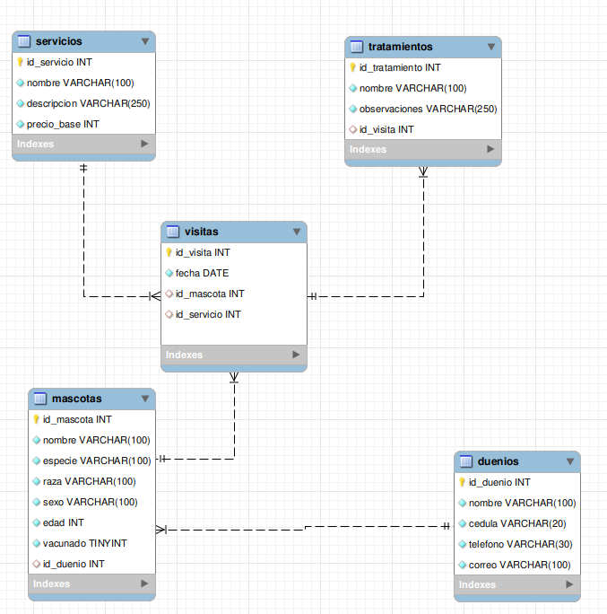

# 🐾 Base de Datos - Veterinaria “Mi Mejor Amigo”

La veterinaria **“Mi Mejor Amigo”** es un centro de atención para mascotas que ofrece servicios médicos, de baño, estética y tratamientos especiales. Con el crecimiento del negocio, el personal administrativo ha tenido dificultades para llevar un registro eficiente de las operaciones diarias, por lo que se desarrolló una **base de datos relacional** para organizar y gestionar toda la información de manera centralizada y segura.

---

## 📋 Requerimientos Funcionales

### 🧑‍⚕️ Dueños de Mascotas
- Registro de datos personales: cédula, nombre completo, teléfono, correo.
- Un dueño puede tener **una o varias mascotas**.

### 🐶 Mascotas
- Datos registrados: nombre, especie (perro, gato, etc.), raza, edad, sexo y estado de vacunación.
- Cada mascota pertenece a **un único dueño**.

### 🧼 Servicios
- La veterinaria ofrece: baño, corte de uñas, consulta médica, desparasitación, vacunación, spa, entre otros.
- Cada servicio tiene: nombre, descripción y precio base.

### 📅 Visitas
- Cada vez que una mascota acude a la veterinaria, se registra una **visita**.
- La visita está vinculada a **una mascota**, **un servicio** y **una fecha específica**.
- Solo se realiza **un servicio por visita**.
- Es posible consultar el historial de visitas de cada mascota.

### 💊 Tratamientos
- En ciertas visitas, el veterinario puede recetar uno o más tratamientos.
- Cada tratamiento incluye: nombre, observaciones, y está vinculado a una visita específica.

---

## 🛠️ Archivos del Proyecto

| Archivo       | Descripción |
|--------------|-------------|
| `ddl.sql`     | Script de creación de la base de datos y tablas. |
| `dml.sql`     | Script de inserción de datos de prueba (dueños, mascotas, servicios, visitas y tratamientos). |
| `dql.sql`     | Consultas SQL para análisis, reportes y extracción de datos relevantes. |
| `modeloUML.png` | Diagrama UML del modelo entidad-relación. |
| `modeloUMLER.mwb` | Archivo del modelo diseñado en MySQL Workbench. |

---

## 🧩 Diagrama Entidad-Relación (ER)

A continuación, se muestra el modelo entidad-relación utilizado para estructurar la base de datos:

---

## 📊 Consultas Destacadas

Incluye consultas como:
- Número total de mascotas.
- Edad promedio.
- Mascotas más jóvenes y longevas.
- Servicios ordenados por precio.
- Historial de visitas de una mascota específica.
- Dueños con cantidad de mascotas.
- Porcentaje de mascotas vacunadas y no vacunadas.

A continuación, un video explicativo con las consultas que se realizaron en este proyecto:

https://youtu.be/7RUO_0AuMWg

---

## 🧠 Tecnologías Usadas

- 💾 **MySQL**
- 🛠️ **MySQL Workbench**
- 📄 SQL puro (DDL, DML, DQL)

---

## 👩‍💻 Autor

Desarrollado por:

[Karol Reyes](https://github.com/KarolainReyes)

[Andres Leal](https://github.com/Andre07g)

---

## 📌 Nota

Este proyecto fue desarrollado con fines educativos para practicar el diseño y manipulación de bases de datos relacionales con un caso de uso realista y cotidiano.

